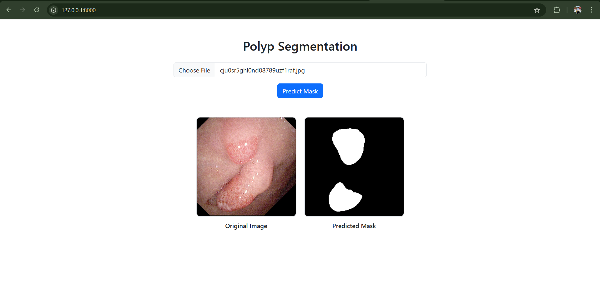

# Polyp_segmentation_from_colonoscopy_FastAPI
This application can segment the polyp from colonoscopy images.
#***The model file is missing in this repository because 357MB can not be uploaded to GitHub. If you need the model file, please contact me***
## project workflow and description

- collected dataset from [kvasir](https://datasets.simula.no/kvasir/)
- preprocessed and clean data
- Augmented the training and validation data. train data: 800 * 27, test: 100 * 27, val: 100 * 27
- Trained on different CNN architectures, got the best model with Accuracy: 96.92, DSC: 97.06, mIoU: 85.04
- Created an api to interact with the model

## setup instruction

### 1. Clone the Repository

```bash
git clone https://github.com/mdparvex/Polyp_segmentation_from_colonoscopy_FastAPI.git

```

## Setup locally (Windows)
Create a virtual environment
```bash
python -m virtualenv <environment_name>
```
Activate the virtual environment
```bash
cd <environment_name>\Scripts
activate
```
install requirements.txt
```bash
pip install -r requirements.txt
```

### How to Run the Server
Go to the project root directory and run
```bash
uvicorn app.main:app
```
### Go to the URL
Access it at: http://127.0.0.1:8000/

### Run with Docker
Build the Docker image
```bash
docker build -t alzapp:latest
```
Run the Docker image
```bash
docker run -d -p 8000:8000 alzapp:latest
```

Access it at: http://127.0.0.1:8000/

### API. `POST /predict/`

**Get the prediction by uploading a polyp colonoscopy image**

```json
POST /predict/
{
  "file": File
}
```

Returns:

```json
{
    "filename": filename,
    "message": "File uploaded successfully"
}
```

---

# Play with the portal
Choose images from the test images folder


