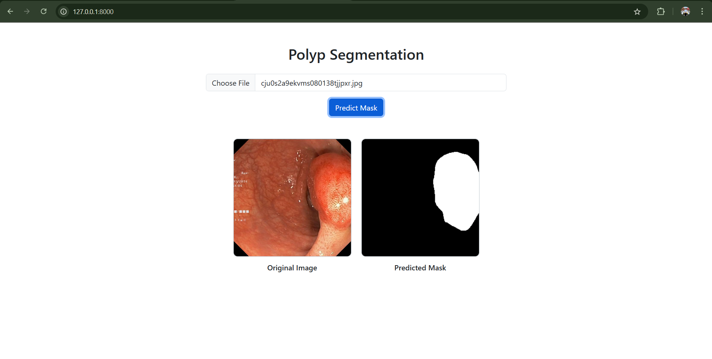

# Transformer‑Enhanced Self‑Attention X‑UNet for Polyp Segmentation

**Semantic segmentation of colorectal polyps from colonoscopy imaging using robust transfer learning with a Transformer‑enhanced self‑attention decoder.**

This repository contains both the **research** (the model, experiments, and results behind our manuscript) and a ready‑to‑run **implementation** — the training notebooks plus a FastAPI web service that serves the trained model for real‑time inference.

<p align="center">
  
  
  
  
</p>

> ### 🏆 Headline result
> On the **Kvasir‑SEG** benchmark, the proposed **Transformer‑Enhanced Self‑Attention X‑UNet** achieves
> **Dice (DSC) 94.39% · mIoU 85.04% · Accuracy 96.92% · Precision 0.95 · Recall 0.92**,
> outperforming standard U‑Net backbones (VGG16, ResUNet, MobileNet, MobileNetV2) and remaining competitive with recent transformer‑based state‑of‑the‑art methods.

---

## Table of contents

1. [Motivation](#1-motivation)
2. [Research contribution](#2-research-contribution)
3. [Method overview](#3-method-overview)
4. [Dataset & preprocessing](#4-dataset--preprocessing)
5. [Results](#5-results)
6. [Repository structure](#6-repository-structure)
7. [Web implementation (FastAPI)](#7-web-implementation-fastapi)
8. [Getting started](#8-getting-started)
9. [API reference](#9-api-reference)
10. [Reproducing the research](#10-reproducing-the-research)
11. [Limitations & future work](#11-limitations--future-work)
12. [Citation](#12-citation)
13. [Authors & contact](#13-authors--contact)

---

## 1. Motivation

Colorectal cancer (CRC) is among the leading causes of cancer‑related death worldwide, and almost every case begins as a **polyp** — a benign growth in the colorectal mucosa that can turn malignant over time. Colonoscopy is the most effective screening tool for detecting polyps, but manual inspection is subject to a **miss rate of up to ~6%**, especially for small or flat polyps with blurred boundaries.

Computer‑aided diagnosis (CADx) can act as a reliable *second reader*: studies suggest AI‑assisted analysis can reduce missed colonic lesions substantially. This project develops an **accurate, automatic, deep‑learning polyp segmentation model** that delineates polyp regions from colonoscopy frames, so it can be deployed as an assistive tool during procedures.

## 2. Research contribution

We designed a **transfer‑learning U‑Net** whose encoder is a pre‑trained **Xception** feature extractor and whose decoder is enhanced with a **Transformer‑style self‑attention mechanism**. The key ideas:

- **Xception encoder (transfer learning).** Depthwise separable convolutions extract deep, boundary‑aware features with far fewer parameters and lower compute than standard convolutions, mitigating the small‑dataset problem common in medical imaging.
- **Transformer‑enhanced self‑attention decoder.** Standard U‑Net decoders struggle to model long‑range dependencies. We add **attention‑gated skip connections** (an additive attention gate in the spirit of Oktay et al., 2018) so the network dynamically emphasises salient polyp regions and suppresses irrelevant activations.
- **Squeeze‑and‑Excitation (SE) recalibration** at the encoder–decoder bridge. The gating signal is augmented with a channel‑wise SE step before it is fused with the skip connection — this is the primary architectural distinction from a plain attention gate.
- **Heavy, training‑only augmentation** to expand and diversify the data without leaking into evaluation.

An **ablation study** and a **paired Wilcoxon signed‑rank test** confirm that the self‑attention gating and the SE recalibration interact *synergistically* — the gain from combining them is larger than either component alone, and the improvement is consistent at the image level rather than driven by a few easy cases.

## 3. Method overview

```
Input frame (256×256×3, normalized 0–1)
        │
   ┌────▼───────────────────────────────┐
   │  ENCODER — Xception entry_flow      │  depthwise separable convs
   │  (ImageNet pre‑trained weights)     │  low‑level → high‑level features
   └────┬───────────────────────────────┘
        │  bridge: block13_sepconv2_bn
   ┌────▼───────────────────────────────┐
   │  Squeeze‑and‑Excitation (SE) block  │  channel‑wise recalibration
   └────┬───────────────────────────────┘
        │
   ┌────▼───────────────────────────────┐
   │  DECODER (×4 blocks), each:         │
   │   1. Transposed‑conv upsampling     │
   │   2. Attention‑gated skip fusion    │  ← self‑attention weighting
   │   3. Skip‑connection refinement     │
   │   4. Conv + BatchNorm               │
   └────┬───────────────────────────────┘
        │
   Predicted binary polyp mask (256×256)
```

**Training configuration**

| Setting | Value |
|---|---|
| Loss | Dice loss |
| Optimizer | Nadam (Nesterov‑accelerated Adam) |
| Primary metric | Dice coefficient |
| Epochs | 19 |
| Batch size | 32 |
| Learning rate | 0.01 → 0.0001 (dynamic) |
| Callbacks | EarlyStopping, ReduceLROnPlateau |

The training/validation loss and accuracy curves show the validation loss staying above the training loss with no divergence, indicating the model does **not overfit**.

## 4. Dataset & preprocessing

- **Dataset:** [Kvasir‑SEG](https://datasets.simula.no/kvasir-seg/) (Simula) — 1,000 gastrointestinal colonoscopy images with expert‑annotated polyp masks.
- **Resize:** original images (332×487 up to 1920×1072) → **256×256**.
- **Normalize:** pixel intensities scaled from 0–255 to **0–1** (ImageNet convention for the pre‑trained encoder).
- **Split:** 80 / 10 / 10 → **800 train / 100 validation / 100 test**.
- **Augmentation (training only):** the 800 training images are expanded to **21,600** using `center_crop`, `random_crop`, horizontal/vertical flip, scale augmentation, random rotation, `cutout`, brightness augmentation, and RGB→grayscale conversion.
  Validation and test sets are kept in their **original, unaugmented** form to prevent data leakage and ensure an unbiased evaluation.

## 5. Results

### 5.1 Backbone comparison (Kvasir‑SEG test set)

| Model | DSC (%) | mIoU (%) | Accuracy (%) | Precision | Recall |
|---|:---:|:---:|:---:|:---:|:---:|
| VGG16 + U‑Net | 91.82 | 75.71 | 95.74 | 0.92 | 0.87 |
| ResU‑Net | 85.94 | 74.15 | 95.41 | 0.93 | 0.76 |
| MobileNet + U‑Net | 92.03 | 78.44 | 95.91 | 0.95 | 0.85 |
| MobileNetV2 + U‑Net | 90.66 | 67.53 | 95.62 | 0.92 | 0.86 |
| **Transformer‑Enhanced Self‑Attention X‑UNet (proposed)** | **94.39** | **85.04** | **96.92** | **0.95** | **0.92** |

### 5.2 Ablation study (same encoder, identical training setup)

| Configuration | DSC (%) | mIoU (%) | Acc. (%) | Prec. | Recall |
|---|:---:|:---:|:---:|:---:|:---:|
| Baseline (no attention, no SE) | 88.87 | 83.00 | 96.86 | 0.89 | 0.92 |
| + Self‑attention only | 88.75 | 83.01 | 96.83 | 0.92 | 0.90 |
| + SE block only | 88.51 | 82.55 | 97.02 | 0.89 | 0.92 |
| **+ Attention + SE (proposed)** | **94.39** | **85.04** | **96.92** | **0.95** | **0.92** |

Neither component alone meaningfully beats the baseline, but combined they lift DSC from 88.87% to **94.39%** — evidence of a **synergistic** interaction: SE recalibrates channel responses at the bridge, and attention gating then uses those recalibrated features to sharpen decoder feature selection.

### 5.3 Statistical significance

Against the strongest same‑encoder baseline, the proposed model scored higher on **93 of 100** test images for DSC (mean 94.39% vs 88.87%, +5.5 points; Wilcoxon signed‑rank **W = 373, p < 0.001**), with the same pattern for mIoU (85.04% vs 83.00%; **W = 1493, p < 0.001**). The improvement is a consistent image‑level effect, not an artifact of outliers.

### 5.4 Comparison with state‑of‑the‑art (Kvasir‑SEG)

| Reference | Method | Dice | mIoU |
|---|---|:---:|:---:|
| Brandão et al. | FCN | 70.23% | 54.20% |
| Qadir et al. | Mask R‑CNN | 70.42% | 61.24% |
| Jha et al. | Double U‑Net | 76.49% | 65.55% |
| Jha et al. | ResUNet + ASPP | 81.33% | 79.27% |
| Jha et al. | ResUNet + TTA + CRF | 85.08% | 83.29% |
| Bulut et al. | U‑Net + CLR | 73.75% | 59.80% |
| Sushma et al. | U‑Net + FTL | 91.10% | 80.80% |
| Yeung et al. | Focus U‑Net (Focus Gate) | 91.00% | 84.50% |
| Galdran et al. | DPN68×2 | 91.70% | 86.74% |
| Duc Nguyen Thanh et al. | ColonFormer | 92.70% | 87.70% |
| **This work** | **Transformer‑Enhanced X‑UNet** | **94.39%** | **85.04%** |

The proposed model attains the **highest Dice** among the surveyed methods, while its mIoU stays within the range of the strongest recent transformer‑based approaches.

## 6. Repository structure

```
Polyp_segmentation_from_colonoscopy_FastAPI/
├── app/
│   ├── main.py            # FastAPI app — GET "/" (portal) and POST "/predict/"
│   ├── utils.py           # preprocessing, Dice metric/loss, mask post‑processing
│   └── templates/
│       └── index.html     # Bootstrap upload portal (original vs predicted mask)
├── test_images/           # 20 sample colonoscopy frames to try in the portal
│
├── X_Unet_with_transformer_enched_self_attention_decoder_polyp_segmentation.ipynb
│                          # ⭐ training notebook for the proposed model
├── xception-unet.ipynb    # Xception U‑Net experiments
├── UNet2.ipynb            # additional U‑Net backbone experiments
│
├── Dockerfile             # containerized serving (python:3.10‑slim)
├── requirements.txt       # pinned dependencies (TensorFlow 2.19, FastAPI, etc.)
└── README.md
```

> ⚠️ **Model weights not included.** The trained model file `xception_unet.keras` (~357 MB) exceeds GitHub's file‑size limit and is **not** in this repository. Please contact the authors (see [§13](#13-authors--contact)) to obtain it, then place it at `app/xception_unet.keras` before running the server.

## 7. Web implementation (FastAPI)

The `app/` package wraps the trained network in a small, production‑style inference service:

- **`main.py`** loads `xception_unet.keras` once at startup (registering the custom `dice_loss` / `dice_coef` objects), serves the upload portal at `/`, and exposes `POST /predict/`.
- **`utils.py`** handles the full inference pipeline: decode the uploaded image → resize to 256×256 → normalize to 0–1 → run the model → threshold the output at 0.5 → return the binary mask as a base64‑encoded PNG data URI.
- **`templates/index.html`** is a lightweight Bootstrap page that uploads an image and displays the **original image and the predicted mask side by side**.

## 8. Getting started

### 8.1 Clone

```bash
git clone https://github.com/mdparvex/Polyp_segmentation_from_colonoscopy_FastAPI.git
cd Polyp_segmentation_from_colonoscopy_FastAPI
```

Then place the trained model file at `app/xception_unet.keras` (see the note in [§6](#6-repository-structure)).

### 8.2 Run locally

Create and activate a virtual environment:

```bash
# Windows
python -m venv venv
venv\Scripts\activate

# macOS / Linux
python3 -m venv venv
source venv/bin/activate
```

Install dependencies and start the server:

```bash
pip install -r requirements.txt
uvicorn app.main:app --reload
```

Open **http://127.0.0.1:8000/**, upload a frame from `test_images/`, and view the predicted mask.

### 8.3 Run with Docker

```bash
docker build -t polypapp:latest .
docker run -d -p 8000:8000 polypapp:latest
```

Then browse to **http://127.0.0.1:8000/**.

## 9. API reference

### `POST /predict/`

Upload a colonoscopy image and receive its segmentation mask.

**Request** — `multipart/form-data`

| Field | Type | Notes |
|---|---|---|
| `file` | image | `.jpg`, `.jpeg`, `.png`, or `.jfif` |

```bash
curl -X POST "http://127.0.0.1:8000/predict/" \
  -F "file=@test_images/cju0qkwl35piu0993l0dewei2.jpg"
```

**Response** — `200 OK`

```json
{
  "file": "data:image/png;base64,<encoded_mask_png>",
  "message": "File uploaded successfully"
}
```
# Play with the portal
Choose images from the test images folder



The `file` value is a ready‑to‑render PNG data URI of the predicted binary mask.

**Errors** — `400` for an unsupported file type, `500` if inference fails (message included in the body).

## 10. Reproducing the research

1. Download **Kvasir‑SEG** from [Simula](https://datasets.simula.no/kvasir-seg/).
2. Open **`X_Unet_with_transformer_enched_self_attention_decoder_polyp_segmentation.ipynb`** (the proposed model). The notebook covers preprocessing, training‑only augmentation, the Xception encoder + SE bridge + attention‑gated decoder, and training with Dice loss / Nadam.
3. `xception-unet.ipynb` and `UNet2.ipynb` reproduce the comparison backbones (Xception baseline and the VGG16 / ResUNet / MobileNet / MobileNetV2 variants).
4. Export the best model to `xception_unet.keras` and drop it into `app/` to serve it via the API.

The notebooks were developed in **Google Colab** (GPU) with Python and TensorFlow/Keras.

## 11. Limitations & future work

- **Static images.** Kvasir‑SEG frames don't capture live‑colonoscopy dynamics (motion blur, peristalsis, lighting changes). Real‑time video inference is a natural next step.
- **External validation.** Testing on datasets *not* used in training — e.g. **CVC‑ClinicDB, CVC‑ColonDB, ETIS‑Larib** — would strengthen generalizability claims.
- **Complex cases.** The data focuses on single/multiple‑polyp frames; conditions such as familial adenomatous polyposis (FAP) are under‑represented.
- **Clinical trials.** Prospective evaluation with gastroenterologists is needed to measure real‑world impact on miss rates.

## 12. Citation

If you use this code or model, please cite the accompanying manuscript:

> Md. Abdulla Al Mamun, Mohsin Kamal Chowdhury, Tanjil Mahmud, H. M. Arifur Rahman, and Mohammad Monirujjaman Khan.
> *Semantic Segmentation of Polyp from Highly Augmented Colonoscopy Imaging using Robust Transfer Learning with Transformer‑Enhanced Self‑Attention Decoder.*
> Department of Electrical and Computer Engineering, North South University, Dhaka, Bangladesh.

```bibtex
@article{almamun_xunet_polyp,
  title   = {Semantic Segmentation of Polyp from Highly Augmented Colonoscopy
             Imaging using Robust Transfer Learning with Transformer-Enhanced
             Self-Attention Decoder},
  author  = {Al Mamun, Md. Abdulla and Chowdhury, Mohsin Kamal and
             Mahmud, Tanjil and Rahman, H. M. Arifur and
             Khan, Mohammad Monirujjaman},
  institution = {North South University},
  note    = {Manuscript}
}
```

## 13. Authors & contact

Department of Electrical and Computer Engineering, North South University, Bashundhara R/A, Dhaka 1229, Bangladesh.

- Md. Abdulla Al Mamun
- Mohsin Kamal Chowdhury
- Tanjil Mahmud
- Mohammad Monirujjaman Khan *(corresponding author — monirujjaman.khan@northsouth.edu)*

For the trained model file (`xception_unet.keras`, ~357 MB) or questions about the implementation, please open an issue on the [repository](https://github.com/mdparvex/Polyp_segmentation_from_colonoscopy_FastAPI) or contact the corresponding author.

---

*Dataset: Kvasir‑SEG is publicly available for research at https://datasets.simula.no/kvasir-seg/.*
